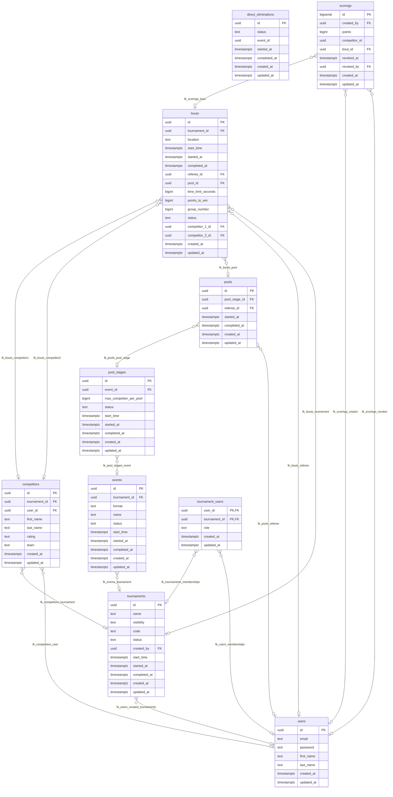

<!-- Generated by make schema-diagram. Do not edit by hand. -->

# Database schema

```mermaid
erDiagram
    bouts {
      uuid id PK
      uuid tournament_id FK
      text location
      timestamptz start_time
      timestamptz started_at
      timestamptz completed_at
      uuid referee_id FK
      uuid pool_id FK
      bigint time_limit_seconds
      bigint points_to_win
      bigint group_number
      text status
      uuid competitor_1_id FK
      uuid competitor_2_id FK
      timestamptz created_at
      timestamptz updated_at
    }
    bouts }o--o| competitors : fk_bouts_competitor1
    bouts }o--o| competitors : fk_bouts_competitor2
    bouts }o--o| pools : fk_bouts_pool
    bouts }o--o| users : fk_bouts_referee
    bouts }o--o| tournaments : fk_bouts_tournament
    competitors {
      uuid id PK
      uuid tournament_id FK
      uuid user_id FK
      text first_name
      text last_name
      text rating
      text team
      timestamptz created_at
      timestamptz updated_at
    }
    competitors }o--o| tournaments : fk_competitors_tournament
    competitors }o--o| users : fk_competitors_user
    direct_eliminations {
      uuid id PK
      text status
      uuid event_id
      timestamptz started_at
      timestamptz completed_at
      timestamptz created_at
      timestamptz updated_at
    }
    events {
      uuid id PK
      uuid tournament_id FK
      text format
      text name
      text status
      timestamptz start_time
      timestamptz started_at
      timestamptz completed_at
      timestamptz created_at
      timestamptz updated_at
    }
    events }o--o| tournaments : fk_events_tournament
    pool_stages {
      uuid id PK
      uuid event_id FK
      bigint max_competitor_per_pool
      text status
      timestamptz start_time
      timestamptz started_at
      timestamptz completed_at
      timestamptz created_at
      timestamptz updated_at
    }
    pool_stages }o--o| events : fk_pool_stages_event
    pools {
      uuid id PK
      uuid pool_stage_id FK
      uuid referee_id FK
      timestamptz started_at
      timestamptz completed_at
      timestamptz created_at
      timestamptz updated_at
    }
    pools }o--o| pool_stages : fk_pools_pool_stage
    pools }o--o| users : fk_pools_referee
    scorings {
      bigserial id PK
      uuid created_by FK
      bigint points
      uuid competitor_id
      uuid bout_id FK
      timestamptz revoked_at
      uuid revoked_by FK
      timestamptz created_at
      timestamptz updated_at
    }
    scorings }o--o| bouts : fk_scorings_bout
    scorings }o--o| users : fk_scorings_creator
    scorings }o--o| users : fk_scorings_revoker
    tournament_users {
      uuid user_id PK,FK
      uuid tournament_id PK,FK
      text role
      timestamptz created_at
      timestamptz updated_at
    }
    tournament_users }o--o| tournaments : fk_tournaments_memberships
    tournament_users }o--o| users : fk_users_memberships
    tournaments {
      uuid id PK
      text name
      text visibility
      text code
      text status
      uuid created_by FK
      timestamptz start_time
      timestamptz started_at
      timestamptz completed_at
      timestamptz created_at
      timestamptz updated_at
    }
    tournaments }o--o| users : fk_users_created_tournaments
    users {
      uuid id PK
      text email
      text password
      text first_name
      text last_name
      timestamptz created_at
      timestamptz updated_at
    }
```
